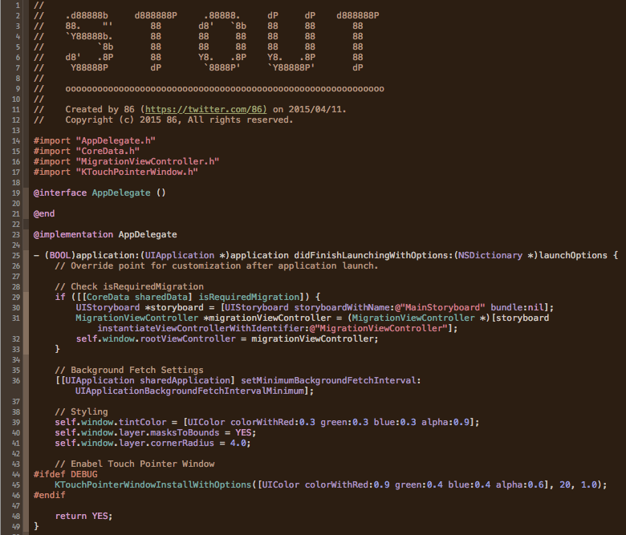

# Xcode-themes
my awsome Xcode color themes


## Themes

### Stout

`Stout` is a dark color theme inspired by one of the dark beer style Stout.



## Usage

### Install using Alcatraz
If you have installed the package manager Akcatraz (http://alcatraz.io):

1. Launch package manager from Xcode > Window > Package Manager
2. Search `Stout` from color themes section
3. Click Install button of `Stout` from search result


### Install manualy
```
$ git clone https://github.com/86/Xcode-themes.git
$ cd Xcode-themes
$ cp *.dvtcolortheme ~/Library/Developer/Xcode/UserData/FontAndColorThemes/
```
And activating theme from Xcode > Preferences > Fonts & Colors.
